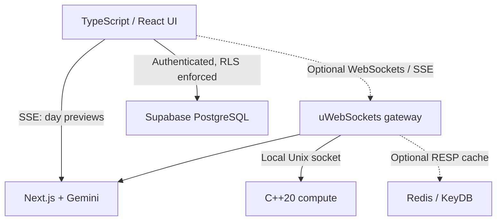

# TravelSetu architecture — implemented foundation

## Two run profiles

**Standard app:** Next.js + Gemini + Supabase. This remains the default: `npm ci`, configure `.env.local`, `npm run dev`. It can deploy to Vercel. Gemini creates the full itinerary; SSE streams completed day previews. The browser receives a final validated itinerary only after generation and available condition checks finish.

**Optional self-hosted services:** a TypeScript uWebSockets.js gateway plus a C++20 Unix-socket process. Set `NEXT_PUBLIC_GATEWAY_URL` to route browser generation through the gateway and enable WebSocket search. The gateway also supports public weather subscriptions and native route-order requests. This profile needs a Linux/macOS host (or WSL2) where long-lived services and Unix sockets are available. It cannot run inside Vercel serverless functions.



The image reference informs the user interface only. Displayed map pins, weather and services come from application data; the screenshot's invented distances, profile and tracking status were not copied as live facts.

## Components and scope

| Layer | Implemented | Boundary |
| --- | --- | --- |
| Client | React/TypeScript, sidebar workspace, immediate destination suggestions, optional WebSocket search, incremental day previews | Static catalog remains for destination discovery; it does not generate new itineraries |
| Gateway | uWebSockets.js, origin checks, Supabase token verification, bounded connections/payload/backpressure, token buckets, per-user concurrency, SSE proxy | No 100-rps or latency claim has been benchmarked; Gemini quotas still apply |
| Ingestion | Subscribed destinations' public weather refreshed every five minutes, deduplicated and cached | Not a comprehensive continuous global traffic/disaster pipeline |
| Native compute | C++20, geographic distance matrix, nearest-neighbour order, dot products with guarded AVX-512 dispatch and scalar fallback | Geographic ordering ignores roads, visit hours and traffic. It never silently rewrites an itinerary |
| CUDA | Optional `.cu` elementwise vector multiplication with host reduction for a dot product | Needs CUDA toolkit/NVIDIA GPU. Small vectors may run slower than CPU. No GPU test was possible here |
| Local LLM | Optional C++ adapter invoking a configured llama.cpp CLI with fixed executable/model paths, bounded prompt/output and timeout | No model weights included; not resident inference, not TensorRT, and not connected as an itinerary fallback. The UI uses Gemini |
| Cache | Bounded process-memory cache; optional RESP2 GET/SET adapter for shared public weather snapshots | Redis disabled unless `REDIS_URL` is supplied. No private trip/account responses are shared in this cache |
| Database | Existing Supabase tables/RLS/PostGIS, plus owner-scoped expense aggregation SQL | PostgreSQL OLTP plus SQL analytics; not a custom HTAP/columnar execution engine |
| C++ SQL | Optional libpqxx operator report binary | Synchronous read transaction; not in the public request path. Use a least-privilege read-only DB role |
| Vectors | Optional owner-scoped pgvector table and cosine-similarity RPC | Requires extension installation and real, model-consistent embeddings. No embedding ingestion/model is fabricated |
| Multi-server RPC | Not included | Local IPC is used; no gRPC deployment or distributed orchestration added |

## Corrections to the initial protocol assumptions

- HTTP/1.1 normally reuses connections, and HTTP/2 multiplexes requests. HTTP does not necessarily open and close a TCP connection for every search. WebSockets are appropriate for two-way events; SSE fits one-way output streams. Neither removes provider rate limits.
- A WebSocket is a long-lived connection, not a permanent guarantee: authentication expiry, reconnects, backpressure and dropped clients still matter. The UI can fall back to local destination search if the optional gateway is unavailable; generation errors remain explicit.
- RESP reads avoid repeated application SQL, but end-to-end response time still includes network, parsing, contention and serialization. This implementation makes no sub-millisecond promise. The small Redis adapter makes bounded cold-cache connections; replace it with a pooled production client if measurements justify Redis at scale.
- AVX-512 is hardware-specific. Runtime dispatch prevents unsupported-instruction crashes on CPUs without it; ARM uses the scalar path. CUDA requires an NVIDIA GPU. A MacBook does not provide CUDA merely because the source compiles as C++20.
- libpqxx offers typed conversions and transaction interfaces; a normal `exec` call is synchronous. Pipelining/asynchronous designs require deliberate APIs and scheduling. MVCC reduces ordinary reader/writer contention but does not remove locks, writer conflicts, query costs, or connection limits.
- PostgreSQL with pgvector is sufficient for initial relational/vector storage; calling it HTAP does not create an analytics engine. Add specialised analytics replicas/storage only after measuring the workload.

## Run the optional gateway

Use Node 22.18+ (Node 24 was used for source checks). In the project root, keep the Next.js app running. In another terminal:

```bash
cd services/gateway
npm ci
cp .env.example .env
npm start
```

Default gateway: `127.0.0.1:3001`. The example enables anonymous development only on loopback, allowed browser origin `http://localhost:3000`, and upstream `http://127.0.0.1:3000`. For a public gateway, turn anonymous mode off, configure Supabase URL/anon key, and put it behind TLS with an exact allowed origin. Do not expose the upstream Gemini endpoint without appropriate account-level quotas and abuse controls. The included limiter allows a 100-request burst with 20 requests/sec refill, shared per authenticated identity, and at most two active generations/compute requests per identity. That is a configured bound, not a throughput benchmark.

Then set this in the **root** `.env.local` and restart Next.js:

```dotenv
NEXT_PUBLIC_GATEWAY_URL=http://localhost:3001
```

Leave it blank to use Next.js directly. No gateway API key is sent in a URL. WebSocket authentication is the first text message, carrying the current Supabase access token; the gateway verifies it with Supabase. Local anonymous sessions share one limiter. Long-lived token renewal/reconnect and comprehensive operational abuse controls should be extended before a public large-scale launch.

### Gateway messages

Connect to `/ws` with the configured Origin. Send `{"type":"auth","token":"ACCESS_TOKEN"}` (empty token only in local anonymous mode). Wait for `ready`.

- `{"type":"search","query":"Manali","requestId":"1"}` → destination results.
- `{"type":"watch-weather","destination":"Manali"}` → public forecast snapshots.
- `{"type":"unwatch-weather"}` → stop the subscription.
- `{"type":"route-order","requestId":"2","points":[{"latitude":26.9,"longitude":75.8},{"latitude":26.91,"longitude":75.81}]}` → native geographic order suggestion, no navigation or itinerary changes.
- `{"type":"ping"}` → `pong`.

`POST /v1/plan` proxies the normal trip payload to Gemini and streams SSE. It requires the configured Origin and a Bearer token except in local anonymous mode. `/health` provides minimal process status, not a promise that upstream providers are healthy.

## Run native compute

From the root on Linux/macOS (use WSL2 on Windows):

```bash
npm run build:compute
./services/compute/build/travelsetu-compute
```

The default socket is `/tmp/travelsetu-<numeric-user-id>/engine.sock` inside an owner-only directory. Set the same `COMPUTE_SOCKET` in the engine/gateway environments if changing it. Use a dedicated private directory. After an unclean stop, stop the old process and remove only its stale socket file before restarting. The service refuses to overwrite an existing socket.

Protocol: one newline-terminated ASCII command per connection, up to 64 KiB; JSON result then connection close. Commands: `PING`, `ROUTE n lat lon ...`, `DOT n a... b...`, `DOT_GPU n a... b...`, `LLM prompt...`. Limits: 64 route points, 4,096 vector values, four workers and 64 queued sockets. Vector/distance work is a foundation for simulation; it is not a custom general AI framework.

For optional CUDA and libpqxx builds (requires their SDKs plus CMake):

```bash
cmake -S services/compute -B services/compute/build-cmake -DTRAVELSETU_CUDA=ON -DTRAVELSETU_POSTGRES=ON
cmake --build services/compute/build-cmake
```

For local LLM experiments, install a compatible llama.cpp CLI yourself, obtain a model under its licence, and set absolute `LLAMA_CLI` and `LLAMA_MODEL` paths. The private IPC `LLM` command runs the CLI with a 512-token cap and 90-second deadline; it returns a completed response, not a streamed resident-model session. Prompts are passed as argv, never through a shell. Do not use sensitive prompts on a shared host where process arguments may be visible. The GUI's itinerary provider remains Gemini by design.

## Database

Run migration `001_travelsetu.sql` only for a fresh project. Existing v0.3 users already have it; apply `002_analytics.sql` for the owner-scoped SQL expense totals. `supabase/optional-vector.sql` is separate and optional; it uses 768-dimensional vectors with a model name so incompatible models are not mixed. No gRPC service is needed to query pgvector from PostgreSQL.

The optional `travelsetu-report` reads a row count using `DATABASE_URL` and libpqxx. It is an operator command, not an authenticated app route; use a read-only role and never give it a browser-exposed service key. Normal trip saves, expenses and reviews continue through Supabase and RLS.

## Verification and limits

Completed in this environment:

- 37 application regression tests, including Gemini-only generation failure, schema validation and split SSE frames.
- Main application and gateway TypeScript checks.
- C++20 compilation, six native/limiter/cache tests, and loading the installed uWebSockets native module.
- Next.js production build.

The live Unix-socket smoke test was attempted, but this environment rejects Unix socket creation with `Operation not permitted`. Therefore gateway/IPC transport, slow-client behaviour and real request throughput are **not live-verified**. Run `npm run test:gateway` on your local Linux/macOS host after building compute and installing gateway dependencies. The script uses port 34912, tests WebSocket authentication/search/compute and cleans up its child processes. It deliberately fails if the transport cannot start; it does not turn that into a passing test.

No Gemini key, Supabase database, Redis server, CUDA device, llama model or libpqxx database credentials were available for live integration checks. No UI browser automation was requested or performed. No deployment is included.

## Primary references

- HTTP connection reuse: https://developer.mozilla.org/en-US/docs/Web/HTTP/Guides/Connection_management_in_HTTP_1.x
- SSE: https://developer.mozilla.org/en-US/docs/Web/API/Server-sent_events/Using_server-sent_events
- uWebSockets: https://github.com/uNetworking/uWebSockets.js
- Gemini structured streams: https://ai.google.dev/gemini-api/docs/structured-output
- libpqxx: https://github.com/jtv/libpqxx
- PostgreSQL concurrency: https://www.postgresql.org/docs/17/explicit-locking.html
- pgvector: https://github.com/pgvector/pgvector
- llama.cpp CLI: https://github.com/ggml-org/llama.cpp/blob/master/tools/cli/README.md
